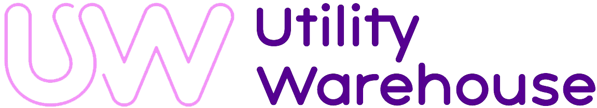
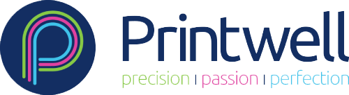
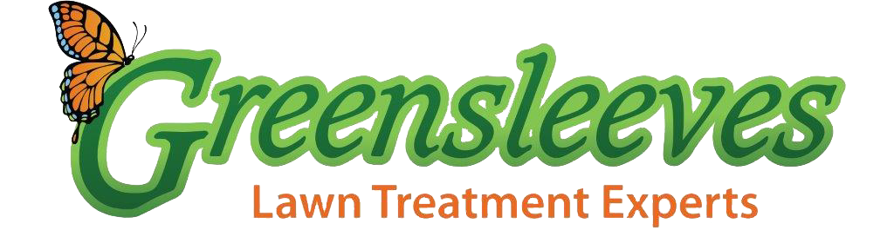
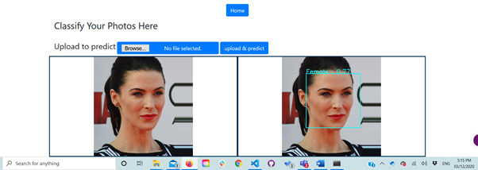
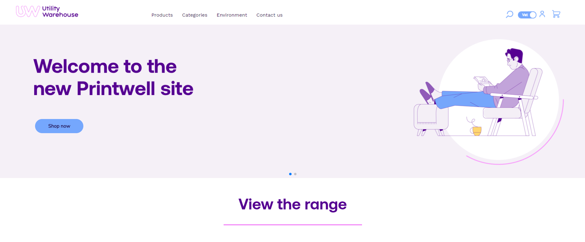

Full-Stack Developer - UX/UI Designer - IT Support 
# Muhammed Khaled 

Proactive and creative professional, with a huge passion to create solutions that have a positive impact on the world. I am currently a final year computer science student on track to achieve a first-class degree in summer 2021. During my studies, I have been freelancing and working with several high-end brands such as **Printwell, Utility Warehouse, Samsung,** and more. Within this time, I have amassed a wealth of experience and skills across software development, UX/UI design, customer service, business operations, leadership, and management. 

I have also been working on several non-profit projects, in the last few years, such as the Learning Management Platform which is planned to help students in third-world countries such as (my home country) Yemen to access free education.

# <ins> What I Do </ins>
##  IT Consultancy
With my extensive experience and knowledge in IT, which I have gained throughout my career and higher education, I am able to provide guidance and profound advice to organizations to increase their efficiency and IT structure and help their businesses thrive faster and operate smarter.

##  Software Development
**Front-End:** HTML, CSS, Bulma, Sass, Tailwind, JavaScript, ReactJS, jQuery, Vue, and Bootstrap.

**Backend:** Python (Flask), Machine Learning, Firebase, Firestore, MongoDB, MySQL, NodeJS, PHP, Rest APIs, and Google APIs.

**Tools:** git, GitLab, Github, npm, yarn, Adobe XD, Photoshop, and Canvas.

**CMS:** WordPress and Catfish.

##  UX/UI Design
Research - User Personas - Storyboards - Customer maps - Brainstorming - User Flows - Site maps - Low-fidelity prototype - hand-drawn sketches - High-fidelity prototypes - interactive prototypes - Usability Reports - Analytics Reports

##  Technical Support
- Microsoft Office Packages, Office 365 administration and Microsoft operating systems administration.
- Active Directory, Networking TCP/IP, DNS, DHCP, VPN, LAN, Switch management and SCCM.
- Maintaining backups and printer management.
- Cybersecurity

# Brands I worked with
 

# Featured projects
## [FaceAI](https://github.com/zinrack/FaceAI)
This End to End Machine learning Application that is able to detect the face of any persons image and classify the image as male or female using ML and flask

## [Utility Warehouse](https://uw.printwell.co.uk/)
This online store is developed for Utility Warehouse on behave Printwell.

